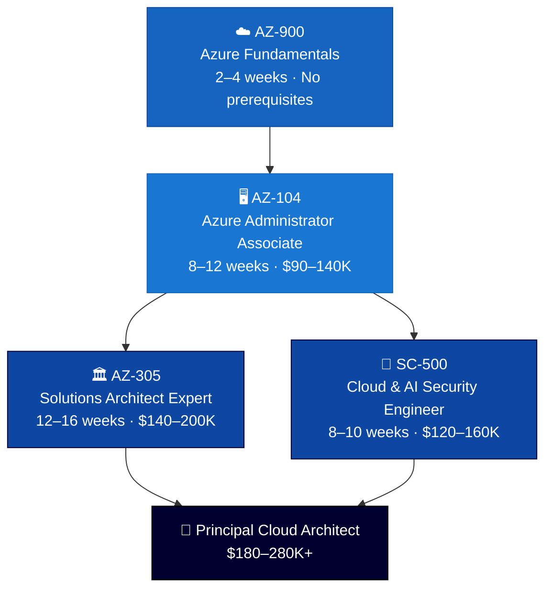
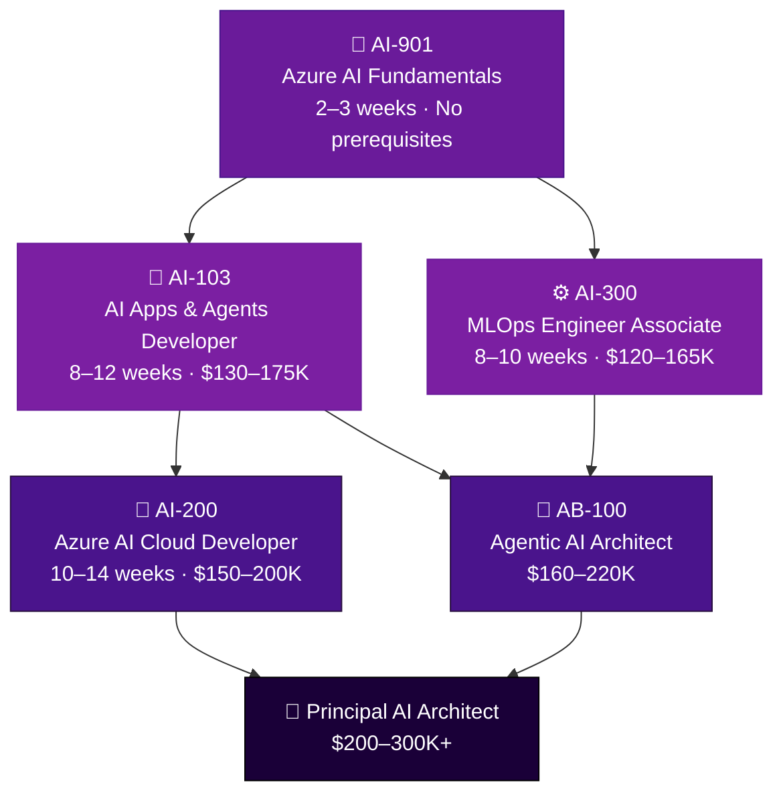
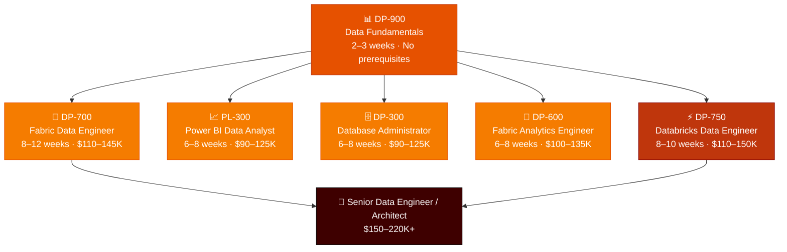
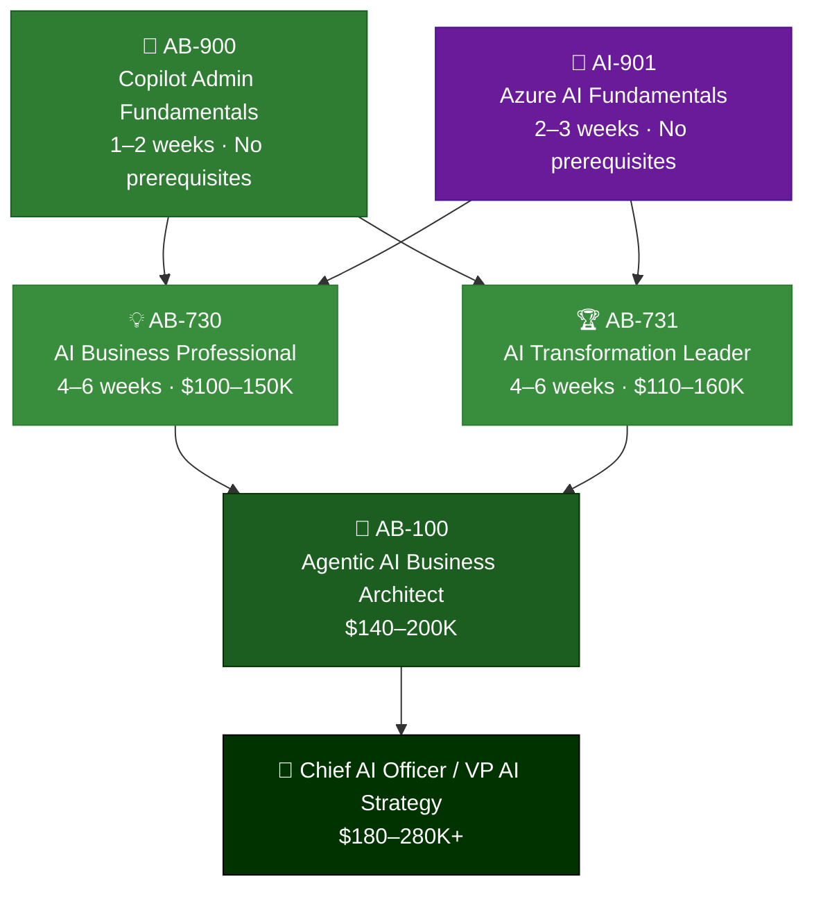
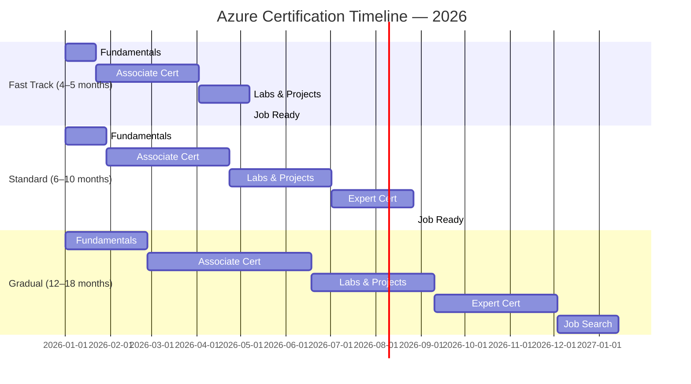
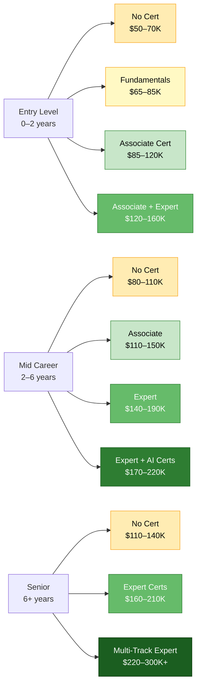
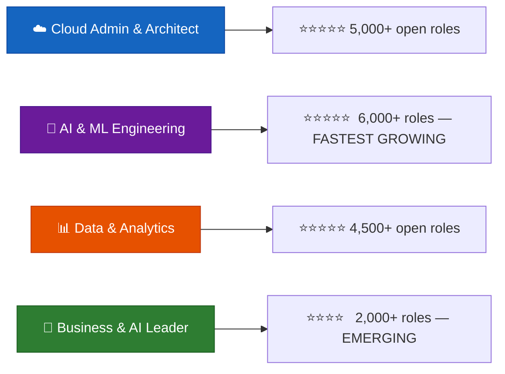

# Microsoft Azure Certification Roadmap 2026

> **K21 Academy** — Career-path guide for Cloud, Data, AI & Business tracks.  
> All certifications listed are actively offered by K21 Academy.

---

## 📊 Complete Career Progression Overview

```mermaid
graph TD
    AZ900["☁️ AZ-900\nAzure Fundamentals"]
    DP900["📊 DP-900\nData Fundamentals"]
    AI901["🤖 AI-901\nAI Fundamentals"]
    AB900["💼 AB-900\nCopilot Admin Fundamentals"]

    AZ900 --> AZ104["🖥️ AZ-104\nAzure Administrator"]
    AZ104 --> AZ305["🏛️ AZ-305\nSolutions Architect Expert"]
    AZ104 --> SC500["🔐 SC-500\nCloud & AI Security Engineer"]

    DP900 --> DP700["🔧 DP-700\nFabric Data Engineer"]
    DP900 --> PL300["📈 PL-300\nPower BI Data Analyst"]
    DP900 --> DP300["🗄️ DP-300\nDatabase Administrator"]
    DP900 --> DP600["📐 DP-600\nFabric Analytics Engineer"]
    DP900 --> DP750["⚡ DP-750\nDatabricks Data Engineer"]

    AI901 --> AI103["🤖 AI-103\nAI Apps & Agents Developer"]
    AI901 --> AI300["⚙️ AI-300\nMLOps Engineer"]
    AI103 --> AI200["🚀 AI-200\nAzure AI Cloud Developer"]
    AI103 --> AB100["🎯 AB-100\nAgentic AI Architect"]
    AI300 --> AB100

    AB900 --> AB730["💡 AB-730\nAI Business Professional"]
    AB900 --> AB731["🏆 AB-731\nAI Transformation Leader"]
    AB730 --> AB100
    AB731 --> AB100

    style AZ900 fill:#1565C0,stroke:#0D47A1,color:#fff
    style DP900 fill:#E65100,stroke:#BF360C,color:#fff
    style AI901 fill:#6A1B9A,stroke:#4A148C,color:#fff
    style AB900 fill:#2E7D32,stroke:#1B5E20,color:#fff

    style AZ104 fill:#1976D2,stroke:#1565C0,color:#fff
    style DP700 fill:#F57C00,stroke:#E65100,color:#fff
    style PL300 fill:#F57C00,stroke:#E65100,color:#fff
    style DP300 fill:#F57C00,stroke:#E65100,color:#fff
    style DP600 fill:#F57C00,stroke:#E65100,color:#fff
    style DP750 fill:#BF360C,stroke:#870000,color:#fff
    style AI103 fill:#7B1FA2,stroke:#6A1B9A,color:#fff
    style AI300 fill:#7B1FA2,stroke:#6A1B9A,color:#fff
    style AB730 fill:#388E3C,stroke:#2E7D32,color:#fff
    style AB731 fill:#388E3C,stroke:#2E7D32,color:#fff

    style AZ305 fill:#0D47A1,stroke:#01002E,color:#fff
    style SC500 fill:#0D47A1,stroke:#01002E,color:#fff
    style AI200 fill:#4A148C,stroke:#280E3F,color:#fff
    style AB100 fill:#1A237E,stroke:#000051,color:#fff
```

---

## 🔵 Track 1 — Cloud Admin & Architect

| Level | Certification | Code | Duration | Salary | K21 Course |
|-------|--------------|------|----------|--------|------------|
| Foundation | Azure Fundamentals | AZ-900 | 2–4 weeks | — | Azure Fundamentals |
| Associate | Azure Administrator | AZ-104 | 8–12 weeks | $90–140K | Azure Administrator Program |
| Expert | Solutions Architect Expert | AZ-305 | 12–16 weeks | $140–200K | Azure Architect Program |
| Expert | Cloud & AI Security Engineer | SC-500 | 8–10 weeks | $120–160K | Cloud Security Program |

**Best for:** IT ops · sysadmins · network engineers moving to cloud · anyone targeting Architect roles
**Timeline:** 4–6 months &nbsp;|&nbsp; **Demand:** ⭐⭐⭐⭐⭐ &nbsp;|&nbsp; **ROI:** 10–20% salary premium

---

## 🟣 Track 2 — AI & ML Engineering

| Level | Certification | Code | Duration | Salary | K21 Course |
|-------|--------------|------|----------|--------|------------|
| Foundation | Azure AI Fundamentals | AI-901 | 2–3 weeks | — | Azure AI Fundamentals |
| Associate | AI Apps & Agents Developer | AI-103 | 8–12 weeks | $130–175K | Azure AI/ML + Agentic AI Mastery |
| Associate | MLOps Engineer | AI-300 | 8–10 weeks | $120–165K | MLOps Mastery Program |
| Expert | Azure AI Cloud Developer | AI-200 | 10–14 weeks | $150–200K | Azure AI Developer Program |
| Expert | Agentic AI Architect | AB-100 | 16–20 weeks total | $160–220K | Agentic AI Mastery Program |

**Best for:** Python devs · ML engineers · GenAI roles · AI-103 + AI-300 + AB-100 = maximum 2026 positioning
**Timeline:** 3–6 months &nbsp;|&nbsp; **Demand:** ⭐⭐⭐⭐⭐ Fastest growing &nbsp;|&nbsp; **ROI:** 20–30% salary premium

---

## 🟠 Track 3 — Data & Analytics

| Level | Certification | Code | Duration | Salary | K21 Course |
|-------|--------------|------|----------|--------|------------|
| Foundation | Data Fundamentals | DP-900 | 2–3 weeks | — | Azure Data Fundamentals |
| Associate | Fabric Data Engineer | DP-700 | 8–12 weeks | $110–145K | Fabric Data Engineering Program |
| Associate | Power BI Data Analyst | PL-300 | 6–8 weeks | $90–125K | Power BI Program |
| Associate | Database Administrator | DP-300 | 6–8 weeks | $90–125K | Azure Database Program |
| Associate | Fabric Analytics Engineer | DP-600 | 6–8 weeks | $100–135K | Fabric Analytics Program |
| Associate | Databricks Data Engineer | DP-750 | 8–10 weeks | $110–150K | Databricks Program |

**Best for:** SQL devs · BI analysts · data engineers · DP-700 + DP-750 = highest-paying data combo in 2026
**Timeline:** 4–8 months &nbsp;|&nbsp; **Demand:** ⭐⭐⭐⭐⭐ &nbsp;|&nbsp; **ROI:** 15–25% salary premium

---

## 🟢 Track 4 — Business & AI Leadership

| Level | Certification | Code | Duration | Salary | K21 Course |
|-------|--------------|------|----------|--------|------------|
| Foundation | Copilot Admin Fundamentals | AB-900 | 1–2 weeks | — | AB-900 Copilot Admin Course |
| Foundation | Azure AI Fundamentals | AI-901 | 2–3 weeks | — | Azure AI Fundamentals |
| Associate | AI Business Professional | AB-730 | 4–6 weeks | $100–150K | AI Business Professional Program |
| Associate | AI Transformation Leader | AB-731 | 4–6 weeks | $110–160K | AI Transformation Leadership Program |
| Expert | Agentic AI Business Architect | AB-100 | 12–16 weeks total | $140–200K | Agentic AI Mastery Program |

**Best for:** Managers · consultants · business analysts · no coding required · unique market positioning
**Timeline:** 2–5 months &nbsp;|&nbsp; **Demand:** ⭐⭐⭐⭐ Rapidly growing &nbsp;|&nbsp; **ROI:** Very few certified competitors

---

## ⏱️ Timeline Comparison

---

## 💰 Salary Impact by Experience Level

---

## 🎯 Job Market Demand — 2026

---

## 🚀 Recommended 2026 Combinations

### For Maximum Job Market Demand
`AZ-900` → `AZ-104` → `AZ-305`

**Salary:** $140–200K &nbsp;|&nbsp; **Time:** 5–7 months &nbsp;|&nbsp; **Market:** ⭐⭐⭐⭐⭐

---

### For Fastest AI Career Pivot
`AI-901` → `AI-103` → `AI-300` → `AB-100`

**Salary:** $160–220K &nbsp;|&nbsp; **Time:** 6–9 months &nbsp;|&nbsp; **Market:** ⭐⭐⭐⭐⭐

---

### For Data Engineers — Highest Growth
`DP-900` → `DP-700` → `DP-750`

**Salary:** $110–150K &nbsp;|&nbsp; **Time:** 5–8 months &nbsp;|&nbsp; **Market:** ⭐⭐⭐⭐⭐

---

### For Business Leaders — Unique Positioning
`AB-900` → `AB-730` → `AB-731` → `AB-100`

**Salary:** $140–200K &nbsp;|&nbsp; **Time:** 3–5 months &nbsp;|&nbsp; **Market:** ⭐⭐⭐⭐

---

## 📋 All K21 Azure Certifications — Quick Reference

| Track | Certification | Code | Level |
|-------|--------------|------|-------|
| Cloud Admin | Azure Fundamentals | AZ-900 | Foundation |
| Cloud Admin | Azure Administrator | AZ-104 | Associate |
| Cloud Admin | Solutions Architect Expert | AZ-305 | Expert |
| Cloud Admin | Cloud & AI Security Engineer | SC-500 | Expert |
| AI & ML | Azure AI Fundamentals | AI-901 | Foundation |
| AI & ML | AI Apps & Agents Developer | AI-103 | Associate |
| AI & ML | MLOps Engineer | AI-300 | Associate |
| AI & ML | Azure AI Cloud Developer | AI-200 | Expert |
| AI & ML | Agentic AI Architect | AB-100 | Expert |
| Data | Data Fundamentals | DP-900 | Foundation |
| Data | Fabric Data Engineer | DP-700 | Associate |
| Data | Power BI Data Analyst | PL-300 | Associate |
| Data | Database Administrator | DP-300 | Associate |
| Data | Fabric Analytics Engineer | DP-600 | Associate |
| Data | Databricks Data Engineer | DP-750 | Associate |
| Business | Copilot Admin Fundamentals | AB-900 | Foundation |
| Business | AI Business Professional | AB-730 | Associate |
| Business | AI Transformation Leader | AB-731 | Associate |

---

## 📌 Key Takeaways

1. **Start with the right fundamentals** — AZ-900, DP-900, AI-901, or AB-900 based on your track
2. **Choose one associate cert first** — go deep before going wide
3. **Hands-on labs matter** — K21 live cohort programs include real project experience
4. **AI track is the fastest growing** — AI-103 + AI-300 + AB-100 has the least certified competition
5. **DP-700 + DP-750** — strongest data engineering combination for 2026
6. **Business track is underserved** — AB-730 + AB-731 + AB-100 offers unique positioning
7. **AZ-305 remains the gold standard** — highest employer demand for Architect roles globally

---

## 🏫 K21 Academy

Trained **46,000+ professionals** across **40+ countries** in Cloud, Data, AI/ML, and Agentic AI.

🌐 [k21academy.com](https://k21academy.com) &nbsp;|&nbsp; 📧 support@k21academy.com

---

*Last Updated: June 2026*
